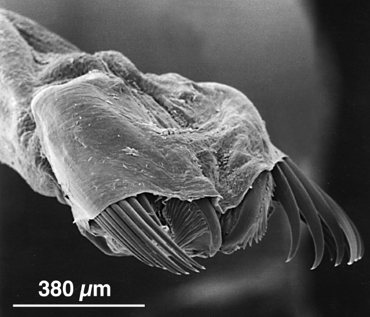

```{r, echo=FALSE, message=FALSE, warning=FALSE}
library(tidyverse)
chaetognaths <- read.csv("tabular_data/arrow_worms_reported_records_gridded.csv")
chaetognath.summary <- read.csv("tabular_data/chaetognath_summary.csv")
new <- chaetognath.summary %>% filter(str_detect(reportingStatus, "new")) 
confirmed <- chaetognath.summary %>% filter(reportingStatus == 'confirmed') 
reported <- chaetognath.summary %>% filter(reportingStatus == 'reported') 
observed <- chaetognath.summary %>% filter(iNatObservationStatus == 'observed') 
unobserved <- chaetognath.summary %>% filter(iNatObservationStatus == 'unobserved') 
```

## Galiano Island's arrow worm diversity

*The name ‘Chaetognatha’ derives from the Greek χαίτη (khaítē), meaning “bristle”, and γνάθος (gnáthos), meaning “jaw”.*

Chaetognatha (arrow worms) are a small phylum of predatory animals, all of which are marine, including 130 extant species in the class Sagittoidea. Though they are not diverse, arrow worms are extremely numerous, representing a major component of marine plankton worldwide. Of the six species of arrow worm known to the Northeast Pacific, four have been sampled in the waters off the coast of British Columbia. It is not possible to determine chaetognath reports in the Galiano Island record as they are based on dive observations, but studies indicate that, in all likelihood, these observations refer to *Parasagitta elegans*.



```{r, echo=FALSE, message=FALSE, warning=FALSE}
source("scripts/Chaetognath_map_script.R")
animal.grid.map
```

## Community science contributions

Since the Biodiversity Galiano project began in 2016, our community has not yet documented any species of arrow worms around Galiano Island, though they have been observed historically through the Pacific Marine Life Surveys. *Parasagitta elegans* is the most abundant species reported from the sheltered inland waters of the Salish Sea. *Eukrohnia hamata* is also known to occur infrequently in inland channels, as an oceanic species that is occasionally borne in by the intrusion of offshore waters. Sampling by use of plankton tows and microscopic analysis would help confirm the local fauna.

```{r, echo=FALSE, message=FALSE, warning=FALSE}
source("scripts/Chaetogath_community_science_contributions.R")
reportingStatusMap
reportingStatusFig
```

## Sources

[Simon, A. D., Adamczyk, E. M., Basman, A., Chu, J. W., Gartner, H. N., Fletcher, K., ... & Starzomski, B. M. (2022). Toward an atlas of Salish Sea biodiversity: the flora and fauna of Galiano Island, British Columbia, Canada. Part I. Marine zoology. Biodiversity Data Journal, 10.](https://bdj.pensoft.net/article/76050/)

```{r setup, include=FALSE}
knitr::opts_chunk$set(echo = TRUE)
```
