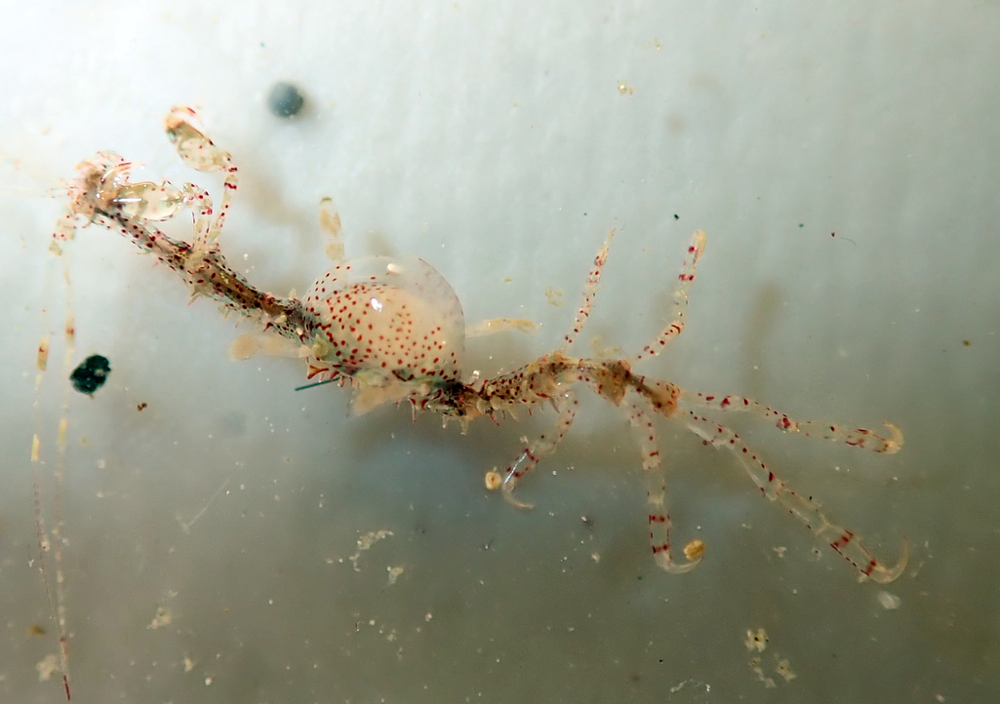

```{r, echo=FALSE, message=FALSE, warning=FALSE}
library(tidyverse)
crustaceans <- read.csv("tabular_data/crustaceans_records_gridded.csv")
crustacean.summary <- read.csv("tabular_data/crustaceans_summary.csv")
new <- crustacean.summary %>% filter(str_detect(reportingStatus, "new")) 
confirmed <- crustacean.summary %>% filter(reportingStatus == 'confirmed') 
reported <- crustacean.summary %>% filter(reportingStatus == 'reported') 
observed <- crustacean.summary %>% filter(iNatObservationStatus == 'observed') 
unobserved <- crustacean.summary %>% filter(iNatObservationStatus == 'unobserved') 
```

## Galiano Island's crustacean diversity

*The name ‘Crustacea’ is rooted in the Modern Latin 'crusta', meaning “shell.”*

Crustacea are a highly diverse subphylum of Arthropoda that contains over 52,000 described terrestrial, marine and freshwater species. This subphylum includes six classes, five of which are represented locally: Branchiopoda (fairy shrimp and water fleas); Hexanauplia (barnacles, copepods and tantulocarids); Ichthyostraca (fish lice); Malacostraca (amphipods, crabs, isopods, krill and shrimp); and Ostracoda (seed shrimp). Over 900 marine crustacean species are known to occur in British Columbia. Of these, `r nrow(crustacean.summary)` species have been reported for Galiano Island, through the combined efforts of more than `r length(unique(crustaceans$recordedBy))` individuals.

Numerous non-native crustaceans are known to the region, though only one introduced species is currently represented in the Galiano Island record. The introduced Japanese skeleton shrimp (*Caprella mutica*), reported for Galiano Island, is now well established along the coast of British Columbia. The invasive European green crab (*Carcinus maenas*) and two tanaids, *Leptochelia dubia* and *Zuexo normani*, have been found off Vancouver Island, but are not yet known locally. Additionally, the non-native amphipods *Ampithoe valida*, *Caprella drepanochir*, *Incisocalliope derzhavini*, *Melita nitida*, *Monocorophium acherusicum*, *Monocorophium insidiosum*, and *Jassa slatteryi*, along with the bay barnacle *Amphibalanus improvisus*, have all been reported in the Strait of Georgia, but have not yet been reported for Galiano Island.



```{r, echo=FALSE, message=FALSE, warning=FALSE}
source("scripts/Diversity_map_script.R")
animal.grid.map <- mx_diversity_map("crustaceans")
animal.grid.map
```

## Community science contributions

Since the Biodiversity Galiano project began in 2016, our community has documented `r nrow(observed)` crustacean species in the waters around Galiano Island, confirming `r round((nrow(confirmed)/(nrow(confirmed)+nrow(reported))*100), digits = 0)` percent of the historical records and adding `r nrow(new)` new species to the list. Of the `r nrow(reported) + nrow(confirmed)` historically reported taxa, `r nrow(reported)` species remain unconfirmed, having gone unreported in the last twenty years.

Many crustaceans are difficult to identify without microscopy, contributing to biases in the local record. Locally, ichthyostracan crustaceans are vastly under-represented and cladocerans and ostracods remain unrepresented to date. As of yet, there are no records of hoplocarids (mantis shrimps), ascothoracids or tantulocarids occurring within British Columbia. The latter two groups will likely be discovered with further investigation; hoplocarids, however, have never been observed north of southern California and are unlikely to occur in the region. Leptostracans are not well described, though at least one species from the genus *Nebalia* is known to the Northeast Pacific. Closer examination of subtidal and intertidal eelgrass, algae wrack and the rocky intertidal zone will uncover many unrecorded taxa.

```{r, echo=FALSE, message=FALSE, warning=FALSE}
source("scripts/Status_map_script.R")
figs <- mx_status_map("crustaceans")
figs$reportingStatusMap
figs$reportingStatusFig
```

## Top community contributions to our knowledge of the island crustacean diversity

Please help contribute to the growing record of the island crustacean diversity by submitting your observations to the [Biodiversity Galiano iNaturalist project.](http://inaturalist.org/projects/biodiversity-galiano-island). Here, you can browse photos of crustacean species commonly documented around Galiano Island, as well as recent observations and top observers, based on [iNaturalist](http://inaturalist.org/) data.

<span class="mxcw-nonLeafletPane mxcw-paneName-TopContributions html-widget leaflet"></span>

## Sources

[Simon, A. D., Adamczyk, E. M., Basman, A., Chu, J. W., Gartner, H. N., Fletcher, K., ... & Starzomski, B. M. (2022). Toward an atlas of Salish Sea biodiversity: the flora and fauna of Galiano Island, British Columbia, Canada. Part I. Marine zoology. Biodiversity Data Journal, 10.](https://bdj.pensoft.net/article/76050/)

```{r setup, include=FALSE}
knitr::opts_chunk$set(echo = TRUE)
```
