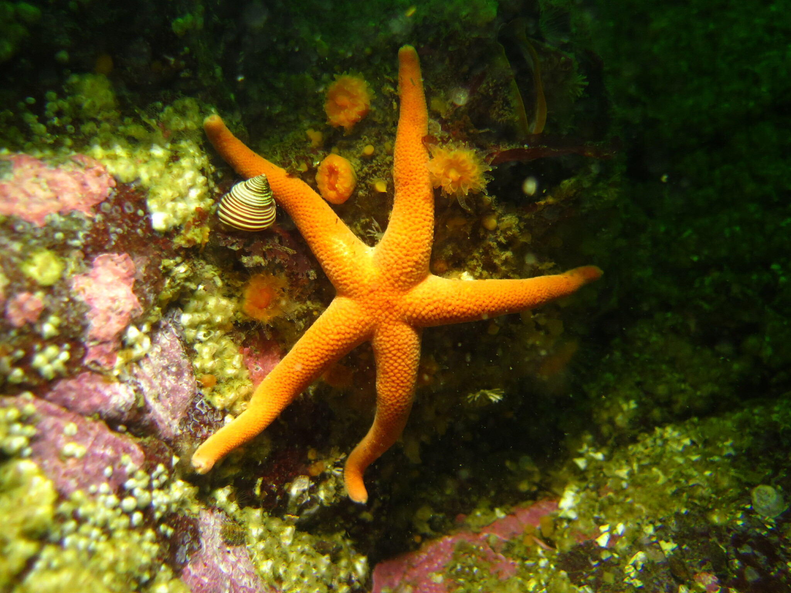

```{r, echo=FALSE, message=FALSE, warning=FALSE}
library(tidyverse)
echinodermata <- read.csv("tabular_data/echinodermata_all_records_gridded.csv")
echinodermata.summary <- read.csv("tabular_data/echinodermata_summary.csv")
new <- echinodermata.summary %>% filter(str_detect(reportingStatus, "new")) 
confirmed <- echinodermata.summary %>% filter(reportingStatus == 'confirmed') 
reported <- echinodermata.summary %>% filter(reportingStatus == 'reported') 
observed <- echinodermata.summary %>% filter(iNatObservationStatus == 'observed') 
unobserved <- echinodermata.summary %>% filter(iNatObservationStatus == 'unobserved') 
```

## Galiano Island's echinoderm diversity

*‘Echinodermata’ is rooted in the Ancient Greek ἐχῖνος (echīnos), meaning “hedgehog”,
and δέρμα (derma), “skin”.*

Echinoderms are a phylum of marine invertebrates characterised by tough, spiny skin and radial symmetry, containing over 7,000 recognised species worldwide. The phylum comprises five extant classes, all of which are represented locally. These include [Asteroidea](#taxon:Asteroidea) (sea stars), [Crinoidea](#taxon:Crinoidea) (crinoids), [Echinoidea](#taxon:Echinoidea) (sea urchins and sand dollars), [Holothuroidea](#taxon:Holothuroidea) (sea cucumbers) and [Ophiuroidea](#taxon:Ophiuroidea) (brittle stars). In total, 111 echinoderm species are known to British Columbia Of these, 41 species have been reported for Galiano Island, through the combined efforts of more than `r length(unique(echinodermata$recordedBy))` individuals.


Echinoderms, especially sea stars, are an ecologically important component of the marine fauna of the Northeast Pacific. The term “keystone species” was first coined by Paine (1966) to describe the dominant influence of the predatory ochre sea star ([*Pisaster ochraceus*](#taxon:Pisaster ochraceus)) over the structure and composition of intertidal communities. Since 2013, sea stars, such as the ochre sea star and the sunflower sea star [*Pycnopodia helianthoides*](#taxon:Pycnopodia helianthoides), have undergone severe declines in the region due to sea star wasting syndrome and their populations have not yet recovered. Research indicates that sea star wasting syndrome may be the consequence of elevated microbial activities induced by high organic matter concentrations, which causes depleted oxygen conditions at the animal-water interface, such that sea stars cannot meet the respiratory oxygen demand of tissues. This phenomenon is likely exacerbated under warmer ocean conditions and anthropogenic nutrient pollution.

```{r, echo=FALSE, message=FALSE, warning=FALSE}
source("scripts/Diversity_map_script.R")
animal.grid.map <- mx_diversity_map("echinodermata")
animal.grid.map
```

## Community science contributions

Since the Biodiversity Galiano project began in 2016, our community has documented `r nrow(observed)` echinoderm species in the waters around Galiano Island, [confirming](#region:confirmed) `r round((nrow(confirmed)/(nrow(confirmed)+nrow(reported))*100), digits = 0)` percent of the historical records and adding no new species to the list. Of the `r nrow(reported) + nrow(confirmed)` historically reported taxa, `r nrow(reported)` species remain unconfirmed, having gone unreported in the last twenty years.

Under-represented echinoderms in the Galiano Island record include the [holothuroids](#taxon:Holothuroidea) and [ophiuroids](#taxon:Ophiuroidea). This gap is likely due to sampling bias, as many of these taxa are found at deeper depths than have been sampled locally or otherwise tend to be buried beneath rock and sediment. Gaps otherwise relate to limits in taxonomic knowledge. For example, the genus *Henricia* is highly variable and in need of clarification. Genetic studies are underway to sort out many suspected new species of *Henricia* between Alaska and California. [*Leptasterias hexactis*](#taxon:Leptasterias hexactis) also belongs to a species complex (*Leptasterias aequalis* species complex) requiring further study.



```{r, echo=FALSE, message=FALSE, warning=FALSE}
source("scripts/Status_map_script.R")
figs <- mx_status_map("echinodermata")
figs$reportingStatusMap
figs$reportingStatusFig
```


## Echinoderms with Indigenous cultural significance

Echinoderms are one of many phyla that have cultural significance to Hul'qumi'num speaking peoples. Generally, echinoderms are regarded as important food sources for delicacy and cultural practice. Many of echinoderm species have experienced declines in populations in recent years, making their havesting and consumption increasingly difficult.

* [Giant Red Sea Cucumber](#taxon:Apostichopus californicus), known in Hul'qumi'num as [**Thikwt**](#taxon:Apostichopus californicus), is regarded as a delicacy by many and is typically cleaned and eaten whole in stews or stocks. Thikwt can be harvested with a 3-pronged spear, rake, or by collection via diving. 

* [Red Sea Urchin](#taxon:Mesocentrotus franciscanus), known in Hul'qumi'num as [**Xihwu**](#taxon:Mesocentrotus franciscanus), is also regarded as a delicacy and can similary be harvested by a 3-pronged spear or rake like Thikwt. Because Xihwu are thin shelled, they can easily be eaten or used for bait. 

* [Green Sea Urchin](#taxon:Strongylocentrotus droebachiensis), known in Hul'qumi'num as [**Skw'itth'i'**](#taxon:Strongylocentrotus droebachiensis), were once common and plentiful on both rocky shores and kelp beds, however, they are now a rare delicacy. Today, to harvest skw'itth'i', journeying to areas with fast moving waters is required. 

```{r, echo=FALSE, message=FALSE, warning=FALSE}
source("scripts/Cultural_map_script.R")
animal.cultural.map <- mx_cultural_map("echinodermata")
animal.cultural.map
```

## Top community contributions to our knowledge of the island echinoderm diversity

Here, you can browse photos of echinoderm species commonly documented around Galiano Island, as well as recent observations, most favourited observations, and top observers, based on [iNaturalist](http://inaturalist.org/) data. Please help contribute to the growing record of the island echinoderm diversity by submitting your observations to the [Biodiversity Galiano iNaturalist project.](http://inaturalist.org/projects/biodiversity-galiano-island) 

<span class="mxcw-nonLeafletPane mxcw-paneName-TopContributions html-widget leaflet"></span>

## Sources

[Simon, A. D., Adamczyk, E. M., Basman, A., Chu, J. W., Gartner, H. N., Fletcher, K., ... & Starzomski, B. M. (2022). Toward an atlas of Salish Sea biodiversity: the flora and fauna of Galiano Island, British Columbia, Canada. Part I. Marine zoology. Biodiversity Data Journal, 10.](https://bdj.pensoft.net/article/76050/)

```{r setup, include=FALSE}
knitr::opts_chunk$set(echo = TRUE)
```
