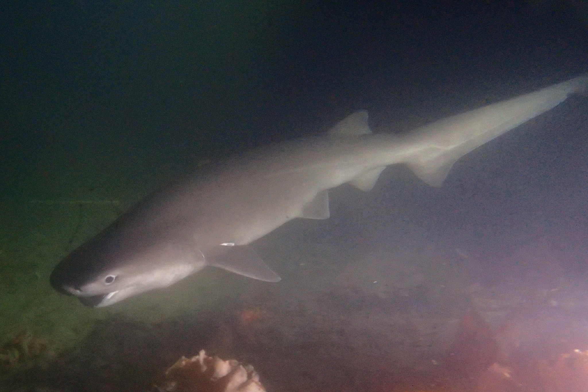

```{r, echo=FALSE, message=FALSE, warning=FALSE}
library(tidyverse)
fishes <- read.csv("tabular_data/fishes_all_records_gridded.csv")
fishes.summary <- read.csv("tabular_data/fishes_summary.csv")
new <- fishes.summary %>% filter(str_detect(reportingStatus, "new")) 
confirmed <- fishes.summary %>% filter(reportingStatus == 'confirmed') 
reported <- fishes.summary %>% filter(reportingStatus == 'reported') 
observed <- fishes.summary %>% filter(iNatObservationStatus == 'observed') 
unobserved <- fishes.summary %>% filter(iNatObservationStatus == 'unobserved') 
```

## Galiano Island's marine fish diversity

*‘Actinopterygii’ is formed from the Latin 'actino-', “having rays”, and the Ancient Greek πτέρυξ (ptérux), meaning “wings” or “fins.” ‘Chondrichthyes’ comes from the Greek χόνδρος (khóndros), meaning "cartilage", and ἰχθύς (ikhthū́s), meaning "fish".*

Actinopterygii contain over 33,000 described taxa and Chondrichthyes (cartilaginous fish) over 1,100 taxa, including both freshwater and marine species. Over 1,500 marine species are estimated to occur between the Beaufort Sea, Alaska, to the tip of Baja California, Mexico and over 400 species reported for Canadian waters in the Northeast Pacific. To date, `r nrow(fishes.summary)` species of ray-finned and cartilaginous fish have been reported for Galiano Island, through the combined efforts of more than `r length(unique(fishes$recordedBy))` individuals.


[Rockfish](#taxon:Sebastinae) are a long-lived and diverse genus of fish in the Northeast Pacific, 11 of which are represented in the Galiano Island record. Species present include the threatened quillback rockfish ([*Sebastes maliger*](#taxon:Sebastes maliger)) and yellow-eye rockfish ([*S. ruberrimus*](#taxon:Sebastes ruberrimus)), the latter of which is ranked as a species of special concern in Canada. This species may attain large sizes (~ 1 m, 12.6 kg). However, as with other species in the genus, it is slow to mature and reproduce and is, therefore, vulnerable to overfishing and fatality due to barotrauma from catch and release. As a consequence, many species of *Sebastes* are at low levels of abundance in the region. Spatially-managed rockfish conservation areas that remain permanently closed to all fishing and extraction activities are vital to ensure their recovery.

```{r, echo=FALSE, message=FALSE, warning=FALSE}
source("scripts/Diversity_map_script.R")
animal.grid.map <- mx_diversity_map("fishes")
animal.grid.map
```

## Community science contributions

Since the Biodiversity Galiano project began in 2016, our community has documented `r nrow(observed)` fish species in the waters around Galiano Island, [confirming](#region:confirmed) `r round((nrow(confirmed)/(nrow(confirmed)+nrow(reported))*100), digits = 0)` percent of the [historical records](#region:historical) and adding `r nrow(new)` [new species](#region:new) to the list. Of the `r nrow(reported) + nrow(confirmed)` historically reported taxa, `r nrow(reported)` species remain unconfirmed, having gone unreported in the last twenty years.

Marine fishes dwell in various habitats, from deep sea (pelagic) to near-shore and intertidal environments. Taxa under-represented in this dataset include cartilaginous fish (chondrichthyes), hagfish (myxinids) and smelts (osmerids). These gaps reflect search efforts mostly biased toward rocky reefs and exposed beach locales, to waters < 30 m in depth. Poachers (agonids), right-eyed flounders ([pleuronectids](#taxon:Pleuronectidae)) and eelpouts (zoarcids) are also under-represented. These are primarily subtidal, soft substrate inhabitants, indicating that sampling has been limited in these habitats. 

We can look to nearby records to get a sense for other species that may be expected locally. For example, the near-threatened bluntnose sixgill shark (*Hexanchus griseus*) is known from adjacent waters around Mayne Island, BC. This species likely occurs around Galiano Island, though it has not yet been reported locally.



```{r, echo=FALSE, message=FALSE, warning=FALSE}
source("scripts/Status_map_script.R")
figs <- mx_status_map("fishes")
figs$reportingStatusMap
figs$reportingStatusFig
```

## Fish with Indigenous cultural significance

Fish are one of many phyla that have cultural significance to Hul'qumi'num speaking peoples, though perhaps the phyla with the most species to reference. Generally, fish are regarded as important food sources for delicacy and cultural practice. 

* [Big Skate](#taxon:Raja binoculata), known in Hul'qumi'num as [**Q'eq'o'**](#taxon:Raja binoculata)
Q'eq'o' is often by-catch, being caught while fishing for other species in tidal flats (i.e. crabs or fish). Q'eq'o' can be caught by hook and line or rake or gaff. Q'eq'o' can be caught at night via gaff or spear in Clam Bay (Penelakut Island) and Shell Beach (Stz'uminus First Nation). They need to be cut immediately after harvesting, using a spear. 

* [Black Rockfish](#taxon:Sebastes melanops), known in Hul'qumi'num as [**Syenyenhw**](#taxon:Sebastes melanops)
Syenyenhw have three species and there are stories relating these fish to both history and practical cultural uses. Syenyenhw are good for eating as they are a rather fatty fish, despite being rather bony. 

* [Red Snapper](#taxon:Sebates ruberrimus), known in Hul'qumi'num as [**Tuqwtuqw**](#taxon:Sebates ruberrimus)
Tuqwtuqw is a real delicacy for many, as traditionally they are harder to catch due to their prevalence in deeper waters. Tuqwtuqw can be found by people who prefer tuqwtuqw or are good fisherman who can find them in shallower waters. The internal organs of tuqwtuqw can be used for bait as well. 

* [Rockfish](#taxon:Sebates spp.), known in Hul'qumi'num as [**T'q'as**](#taxon:Sebates spp.)
T'q'as is the general name to refer to all rockfish and can be caught using nets, lure, spears, as well as hook and line. 

* [Trout](#taxon:Oncorhynchus spp.), known in Hul'qumi'num as [**Kw'suts**](#taxon:Oncorhynchus spp.)
Kw'suts is the general term of all trout species, excluding steelhead. Kw'suts are an important food source during times of year when salmon are less accessible. Kw'suts are typically found on the edges and higher regions of rivers, less affected by rivers floods. 

* [Spring Salmon (Chinook Salmon)](#taxon:Oncorhynchus tshaytscha), known in Hul'qumi'num as [**Stth'a'qwi'**](#taxon:Oncorhynchus tshaytscha)
Stth'a'qwi' is one of the first salmon to begin their return to ancestral spawing grounds, thus, they have suffered severe overfishing and no longer arrive in spring for the spawning. Stth'a'qwi' arrive to lay their eggs in the mid to late summer, spawning in the upper reaches of river systems. Smaller sized stth'a'qwi' are preferred for their taste. Stth'a'qwi' that have made the journey up river typically become dark or black in colour and are called si-ne'uts. Stth'a'qwi' skin can be used for raincoats due to both it's large size and waterproof properties. 

* [Chum Salmon](#taxon:Oncorhynchus keta), known in Hul'qumi'num as [**Kw'a'luhw**](#taxon:Oncorhynchus keta)
Kw'a'luhw are regarded as the eldest (suntl'e) of salmon species, being called kw'a'luhw for their tiger-striped stage or appearance change when they enter the freshwater river system from the ocean. Kw'a'luhw are called xi'le'ts as when they are at the stage where their scales begin to fall off, signifying the time when they are ready to be made into a delicacy. Kw'a'luhw are a preferred species for smoking despite being less rich than other species. 

* [Coho Salmon](#taxon:Oncorhynchus kisutch), known in Hul'qumi'num as [**The'wun**](#taxon:Oncorhynchus kisutch)
The'wun return to their ancestral spawning bed, with three runs happening in the year in December, March, and April. However, in recent history, both the March and April runs are becoming extinct. The'wun are an important food resource in the winter when it is harder to catch fresh salmon, hence the runs become an important event for food access. The'wun is one of the richer salmons species and is also typically smoked. 

* [Pink Salmon](#taxon:Oncorhynchus gorbuscha), known in Hul'qumi'num as [**Haan**](#taxon:Oncorhynchus gorbuscha)
Haan only live 2 years, with only 6 months spent swiming to retrn to their freshwater spawning grounds. Haan is less rich than other species but easier to preserve. Haan are not a commerically viable species due to their difficult processing technique and the ability of their meat to rapidly become mushy and soft. Once rare in the Cowichan River, they are now abundant. 

* [English Sole](#taxon:Parophrys vetulus), known in Hul'qumi'num as [**Lhumuq'e'**](#taxon:Parophrys vetulus)
Lhumuq'e' (also referred to as puli'hwus' which means high-coloured head or hair) are typically caught by spear or by catching them barefoot by wading into the water shallows and holding them down. They can be used as bait to catch larger fish. 

* [Starry Flounder](#taxon:Platichthys stellatus), known in Hul'qumi'num as [**P'uwi'**](#taxon:Platichthys stellatus)
P'uwi' is an important food source, caught at times when salmon is less available. P'uwi' can be caught with a spear or hook and line. 

* [Kelp Greenling](#taxon:Haxagrammos decagrammus), known in Hul'qumi'num as [**Tth'umuqwa'**](#taxon:Haxagrammos decagrammus)
Tth'umuqwa' can be used for food or bait, depending on personal preference. Tth'umuqwa' are typically caught via spear by breaking sea urchines open underwater to serve as bait. 

* [Lingcod](#taxon:Ophiodon elongatus), known in Hul'qumi'num as [**'Eeyt**](#taxon:Ophiodon elongatus)
'Eeyt were once an abundant and well harvested species, with a special wooden lure (s-kewq-up) or live bait used to attract fish to the surface. They would then be thrown a spear from a canoe or the shory to collect them. They can also be collected by reef net or line fishing. 

The eggs of lingcod, known in Hul'qumi'num as **Xuy'xuy'tl**, are typically found in depths of 3-5 metres, with males guarding eggs in nests created from December to March. Only a portion of eggs are harvestedin, using a 3-pronged spear (shtl'e'lhunum') to collect a variety of seafood. People with special knowledge use xuy'xuy'tl to predict the weather. 

* [Pacific Herring](#taxon:Clupea pallasi), known in Hul'qumi'num as [**Slhewut'**](#taxon:Clupea pallasi)
Slhewut' maintain transient and resident populations. In early spring, slhewut' spawn in large schools where one can see the white clouds in the shallows. Seabirds, eagles, and sea lions aggregating can be important indictors for slhewut' and their spawn. Slhewut' are an important food resource and are often smoked by hanging them on a stick like bananas. 

* [Striped Seaperch](#taxon:Embiotoca lateralis), known in Hul'qumi'num as [**Wiitsi'**](#taxon:Embiotoca lateralis)
Wiitsi' is one of the largest species in the perch family of fish. They are often caught by beach seine nets near rocky shores or gravel beaches. 

```{r, echo=FALSE, message=FALSE, warning=FALSE}
source("scripts/Cultural_map_script.R")
animal.cultural.map <- mx_cultural_map("fishes")
animal.cultural.map
```


## Top community contributions to our knowledge of the island fish diversity

Here, you can browse photos of fish species commonly documented around Galiano Island, as well as recent observations, most favourited observations, and top observers, based on [iNaturalist](http://inaturalist.org/) data. Please help contribute to the growing record of the island fish diversity by submitting your observations to the [Biodiversity Galiano iNaturalist project.](http://inaturalist.org/projects/biodiversity-galiano-island) 

<span class="mxcw-nonLeafletPane mxcw-paneName-TopContributions html-widget leaflet"></span>

## Sources

[Simon, A. D., Adamczyk, E. M., Basman, A., Chu, J. W., Gartner, H. N., Fletcher, K., ... & Starzomski, B. M. (2022). Toward an atlas of Salish Sea biodiversity: the flora and fauna of Galiano Island, British Columbia, Canada. Part I. Marine zoology. Biodiversity Data Journal, 10.](https://bdj.pensoft.net/article/76050/)

```{r setup, include=FALSE}
knitr::opts_chunk$set(echo = TRUE)
```
