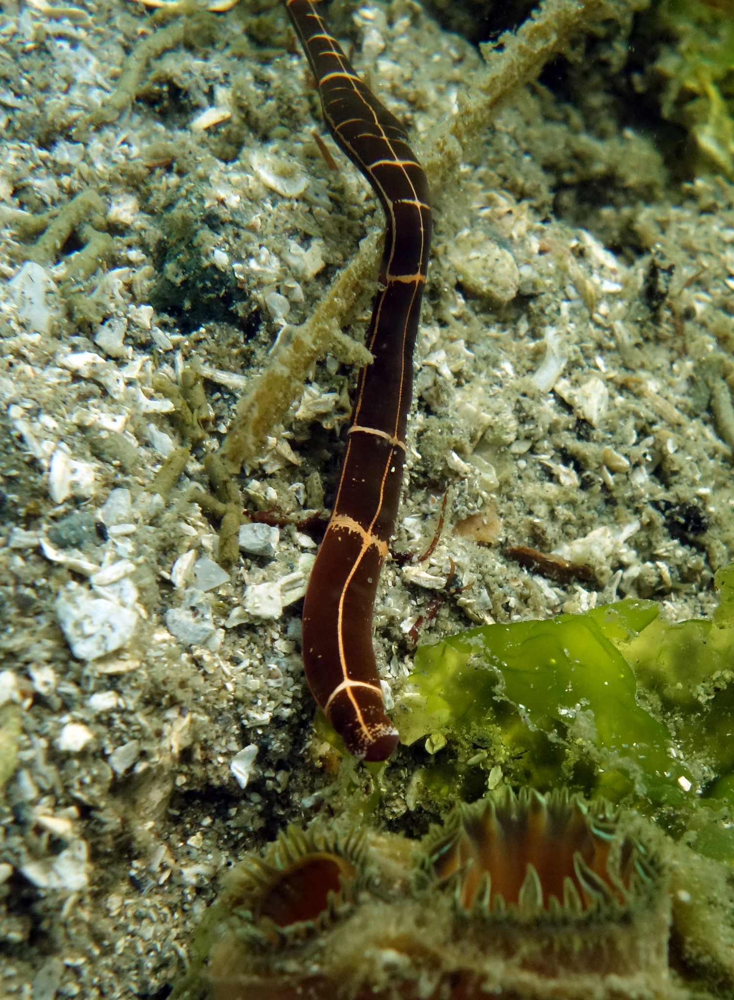

```{r, echo=FALSE, message=FALSE, warning=FALSE}
library(tidyverse)
nemerteans <- read.csv("tabular_data/nemertea_all_records_gridded.csv")
nemerteans.summary <- read.csv("tabular_data/nemertea_summary.csv")
new <- nemerteans.summary %>% filter(str_detect(reportingStatus, "new")) 
confirmed <- nemerteans.summary %>% filter(reportingStatus == 'confirmed') 
reported <- nemerteans.summary %>% filter(reportingStatus == 'reported') 
observed <- nemerteans.summary %>% filter(iNatObservationStatus == 'observed') 
unobserved <- nemerteans.summary %>% filter(iNatObservationStatus == 'unobserved') 
```

## Galiano Island's nemertean diversity

*‘Nemertea’ is the Modern Latin (plural) form of the Greek νημερτής (Nēmertēs)—the name of a sea nymph.*

Nemertea, also known as ribbon worms, are a phylum of soft-bodied and unsegmented invertebrate animals. Over 1,300 extant species, mostly found in marine environments, have been described globally. Traditionally separated into two classes, four classes are now recognised: the Arhynchocoela, Hoplonemertea, Palaeonemertea and Pilidiophora. The Salish Sea is home to 30 of the 41 nemertean species known to the coast of British Columbia. Of these taxa, `r nrow(nemerteans.summary)` species have been documented for Galiano Island to date.

The key diagnostic features of Nemertea are proboscis characteristics: for example, whether it is armed or unarmed or split into regions. This makes identification of many species difficult as it requires examination of internal anatomy. Some species, such as the six-lined ribbon worm ([*Tubulanus sexlineatus*](#taxon:Tubulanus sexlineatus)), have distinct colour patterns and can be readily identified in the field. Otherwise, a more complete knowledge of Galiano Island's nemerteans will require specialised taxonomic expertise and sampling targeting benthic communities.



```{r, echo=FALSE, message=FALSE, warning=FALSE}
source("scripts/Diversity_map_script.R")
animal.grid.map <- mx_diversity_map("nemertea")
animal.grid.map
```

## Community science contributions

Since the Biodiversity Galiano project began in 2016, our community has documented `r nrow(observed)` nemertean species in the waters around Galiano Island, [confirming](#region:confirmed) `r round((nrow(confirmed)/(nrow(confirmed)+nrow(reported))*100), digits = 0)` percent of the [historical records](#region:historical) and adding `r nrow(new)` [new](#region:new) species to the list. Of the `r nrow(reported) + nrow(confirmed)` historically reported taxa, `r nrow(reported)` species remain unconfirmed, having gone unreported in the last twenty years.

Most nemerteans live in benthic environments, lurking in crevices beneath stones, shells and at the bases of algae or sessile animals. They are largely predatory or scavenging animals, feeding on annelids, clams and crustaceans, though some are commensalists that live within the mantle cavity of molluscs where they feed on micro-organisms filtered out by their hosts. Sampling nemerteans intertidally is most easily accomplished by flipping stones on the beach or by careful observation at very low tides when they are most likely to be exposed.

```{r, echo=FALSE, message=FALSE, warning=FALSE}
source("scripts/Status_map_script.R")
figs <- mx_status_map("nemertea")
figs$reportingStatusMap
figs$reportingStatusFig
```

## Top community contributions to our knowledge of the island nemertean diversity

Here, you can browse photos of nemerteans commonly documented around Galiano Island, as well as recent observations, most favourited observations, and top observers, based on [iNaturalist](http://inaturalist.org/) data. Please help contribute to the growing record of the island nemertean diversity by submitting your observations to the [Biodiversity Galiano iNaturalist project.](http://inaturalist.org/projects/biodiversity-galiano-island) 

<span class="mxcw-nonLeafletPane mxcw-paneName-TopContributions html-widget leaflet"></span>

## Sources

[Simon, A. D., Adamczyk, E. M., Basman, A., Chu, J. W., Gartner, H. N., Fletcher, K., ... & Starzomski, B. M. (2022). Toward an atlas of Salish Sea biodiversity: the flora and fauna of Galiano Island, British Columbia, Canada. Part I. Marine zoology. Biodiversity Data Journal, 10.](https://bdj.pensoft.net/article/76050/)

```{r setup, include=FALSE}
knitr::opts_chunk$set(echo = TRUE)
```
