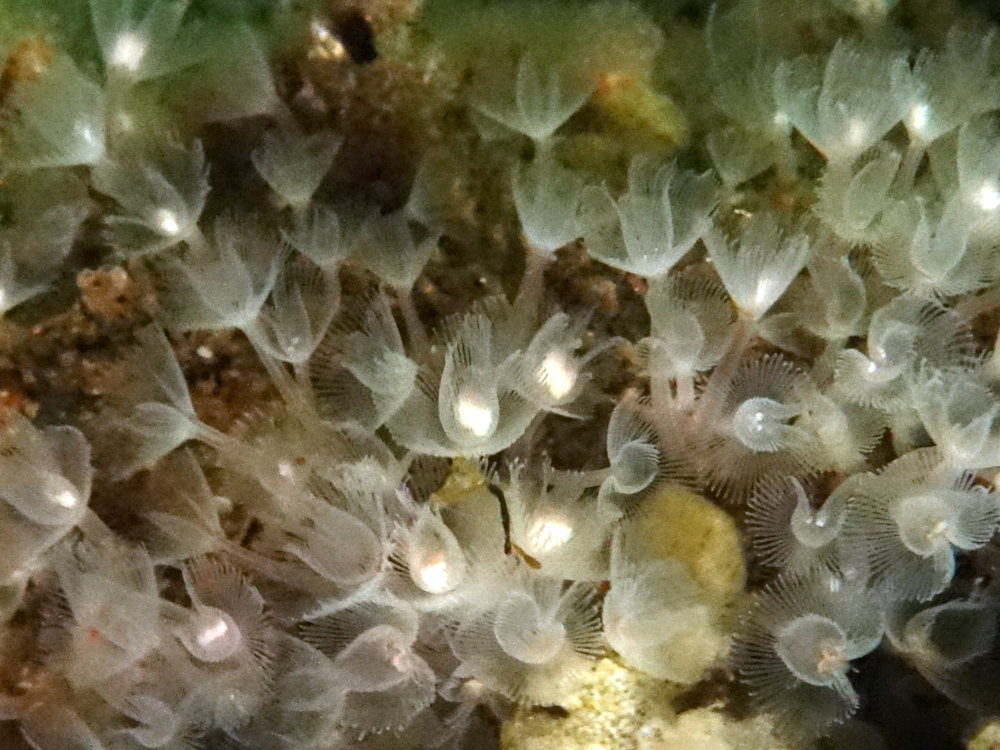

```{r, echo=FALSE, message=FALSE, warning=FALSE}
library(tidyverse)
horseshoe.worms <- read.csv("tabular_data/phoronida_reported_records_gridded.csv")
horseshoe.worms.summary <- read.csv("tabular_data/phoronida_summary.csv")
new <- horseshoe.worms.summary %>% filter(str_detect(reportingStatus, "new")) 
confirmed <- horseshoe.worms.summary %>% filter(reportingStatus == 'confirmed') 
reported <- horseshoe.worms.summary %>% filter(reportingStatus == 'reported') 
observed <- horseshoe.worms.summary %>% filter(iNatObservationStatus == 'observed') 
unobserved <- horseshoe.worms.summary %>% filter(iNatObservationStatus == 'unobserved') 
```

## Galiano Island's horseshoe worm diversity

*‘Phoronida’ is the plural form of the phylum’s type genus Phoronis, likely derived from
the Latin 'Phoronis' (the last name of the mythical Io, priestess of Argos).*

Phoronida (horseshoe worms) are a small phylum of soft-bodied filter-feeding marine animals that form upright tubes of chiton to support their bodies. Worldwide the phylum includes two genera, comprising 13 recognised species. Six species are reported for the Northeast Pacific (Carlton 2007), of which one
species is known locally: [*Phoronis ijimai*](#taxon:Phoronis ijimai).

Phoronids are called “horseshoe worms” because the top of their worm-like body contains rows of ciliated tentacles forming a horseshoe shape. This is the lophophore—the feeding organ they share in common with the [Brachiopoda]([Brachiopoda-Reknitted.html), [Bryozoa](Bryozoa-Reknitted.html) and [Entoprocta](Entoprocta-Reknitted.html).



```{r, echo=FALSE, message=FALSE, warning=FALSE}
source("scripts/Diversity_map_script.R")
animal.grid.map <- mx_diversity_map("phoronida")
animal.grid.map
```

## Community science contributions

Since the Biodiversity Galiano project began in 2016, our community has documented `r nrow(observed)` phoronid species in the waters around Galiano Island, [confirming](region:confirmed) all known historical records and adding no new species to the list.

Phoronids are benthic organisms that occur at depths ranging from the intertidal zone to about 400 m of depth in all oceans and seas throughout the world, except the Antarctic seas. Their larvae are pelagic and feed on plankton, sometimes comprising a large proportion of zooplanktonic biomass. Of the six species reported for the region, it is uncertain which may be expected to occur around Galiano Island, though *Phoronopsis harmeri* has been reported nearby from the Saanich Inlet (RBCM 976-01136-010). Collections
are sparse for this understudied phylum and much doubt surrounds the taxonomy and distributional ecology of the regional fauna. Keys are based on fully developed larval stages, so investigations into this phylum generally entail raising larvae to advanced stages so that they can be reliably compared to illustrations for identification. Even then, their determination is usually based on internal anatomy, which often can only be gleaned by examining microscopically thin sections. Given the challenges associated with this group, most collections at the Royal British Columbia Museum remain unidentified.

```{r, echo=FALSE, message=FALSE, warning=FALSE}
source("scripts/Status_map_script.R")
figs <- mx_status_map("phoronida")
figs$reportingStatusMap
figs$reportingStatusFig
```

## Top community contributions to our knowledge of Galiano Island's bryozoan diversity

Here, you can browse photos of mammal species commonly documented around Galiano Island, as well as recent observations, most favourited observations, and top observers, based on [iNaturalist](http://inaturalist.org/) data. Please help contribute to the growing record of the island bryozoan diversity by submitting your observations to the [Biodiversity Galiano iNaturalist project.](http://inaturalist.org/projects/biodiversity-galiano-island) 

<span class="mxcw-nonLeafletPane mxcw-paneName-TopContributions html-widget leaflet"></span>

## Sources

[Simon, A. D., Adamczyk, E. M., Basman, A., Chu, J. W., Gartner, H. N., Fletcher, K., ... & Starzomski, B. M. (2022). Toward an atlas of Salish Sea biodiversity: the flora and fauna of Galiano Island, British Columbia, Canada. Part I. Marine zoology. Biodiversity Data Journal, 10.](https://bdj.pensoft.net/article/76050/)

```{r setup, include=FALSE}
knitr::opts_chunk$set(echo = TRUE)
```
