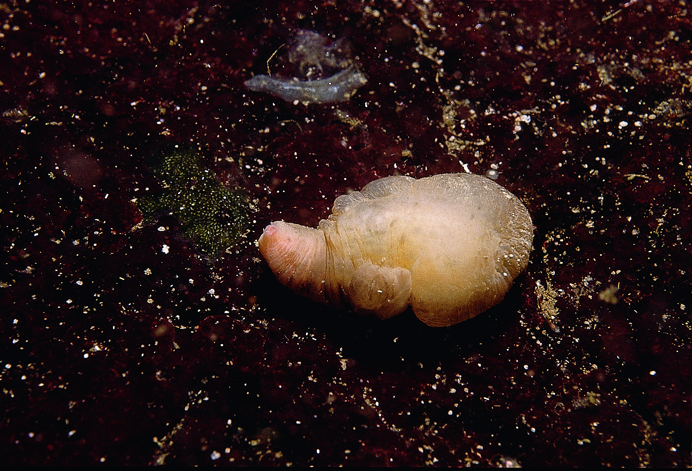

```{r, echo=FALSE, message=FALSE, warning=FALSE}
library(tidyverse)
peanut.worms <- read.csv("tabular_data/peanut_worms_records_gridded.csv")
peanut.worm.summary <- read.csv("tabular_data/peanut_worms_summary.csv")
new <- peanut.worm.summary %>% filter(str_detect(reportingStatus, "new")) 
confirmed <- peanut.worm.summary %>% filter(reportingStatus == 'confirmed') 
reported <- peanut.worm.summary %>% filter(reportingStatus == 'reported') 
observed <- peanut.worm.summary %>% filter(iNatObservationStatus == 'observed') 
unobserved <- peanut.worm.summary %>% filter(iNatObservationStatus == 'unobserved') 
```

## Galiano Island's peanut worm diversity

*‘Sipuncula’ is the Modern Latin plural form of the genus Sipunculus, based on the Latin 'siphunculus', meaning “small tube.”*

Sipuncula (peanut worms) are a small phylum of bilaterally symmetrical, unsegmented marine worms, represented by 150 species worldwide—though a certain amount of cryptic diversity is understood to remain hidden in the phylum. Based on molecular evidence, Sipuncula are now considered to be nested within the phylum Annelida along with Echiura (spoon worms), yet are here treated as a separate phylum. Eight species of Sipuncula are known to the Northeast Pacific, of which one, *Golfingia* (*Golfingia*) *vulgaris vulgaris* is reported for Galiano Island.



```{r, echo=FALSE, message=FALSE, warning=FALSE}
source("scripts/Diversity_map_script.R")
animal.grid.map <- mx_diversity_map("peanut_worms")
animal.grid.map
```

## Community science contributions

Since the Biodiversity Galiano project began in 2016, our community has not yet documented *Golfingia vulgaris*, the only species of peanut worm that is historically reported for the island, which will likely be uncovered with more search effort. Due to their burrowing habit, sipunculids are obscure organisms easily overlooked by divers and casual beachcombers. Some Sipuncula inhabit rock crevices or similar protected areas, while others are found in sand or mud. With further search effort, other taxa likely to be uncovered in the waters around Galiano Island include *Phascolosoma* (*Phascolosoma*) *agassizii* and *Themiste* (*Themiste*) *pyroides*. Identification relies on features of the tentacles which tend to be drawn into the body when contracted, hence the common name “peanut worms.”

```{r, echo=FALSE, message=FALSE, warning=FALSE}
source("scripts/Status_map_script.R")
figs <- mx_status_map("peanut_worms")
figs$reportingStatusMap
figs$reportingStatusFig
```

## Sources

[Simon, A. D., Adamczyk, E. M., Basman, A., Chu, J. W., Gartner, H. N., Fletcher, K., ... & Starzomski, B. M. (2022). Toward an atlas of Salish Sea biodiversity: the flora and fauna of Galiano Island, British Columbia, Canada. Part I. Marine zoology. Biodiversity Data Journal, 10.](https://bdj.pensoft.net/article/76050/)

```{r setup, include=FALSE}
knitr::opts_chunk$set(echo = TRUE)
```
